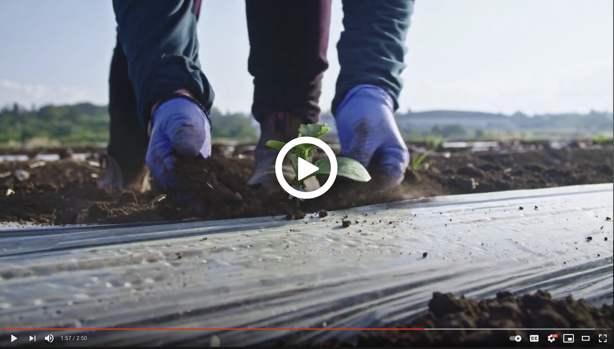
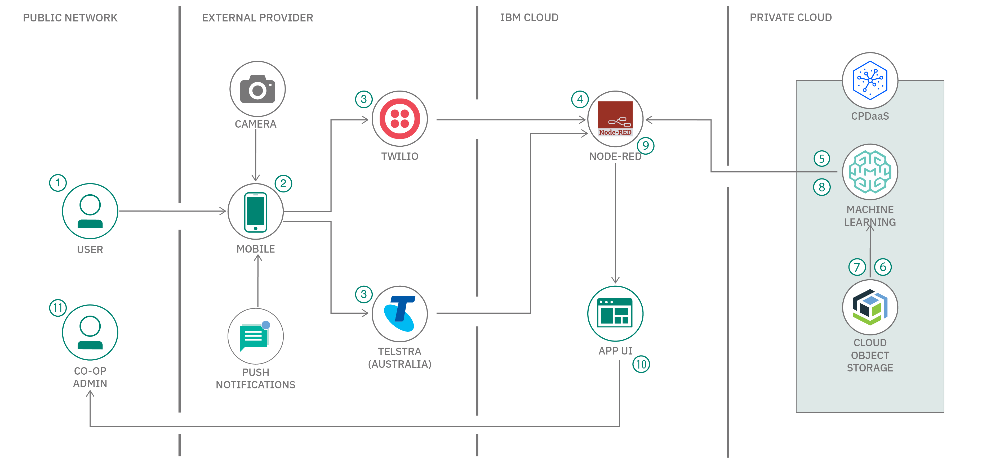

# Call for Code solution starter kit: Zero hunger

[](https://www.apache.org/licenses/LICENSE-2.0) [](https://callforcode.org/slack) [](https://developer.ibm.com/callforcode/get-started/climate-change/zero-hunger/)

Hunger is a global issue, where millions of people around the world have insufficient access to adequate food. According to the [UN Hunger Report](http://www.fao.org/publications/sofi/en/), the number of people globally who are are experiencing severe food insecurity — meaning that they go for entire days without eating due to lack of money, lack of access to food, or other resources, has been slowly rising since 2014. Use this starter kit to build applications to address the real-world challenge of global hunger by enabling independant farmers. The starter kit provides tools and resources from our experts to help you jump-start your own solution.

## Contents

1. [Background](#background)
1. [Video](#video)
1. [The architecture](#the-architecture)
1. [Getting started](#getting-started)
1. [Contributing](#contributing)
1. [Authors](#authors)
1. [License](#license)

## Short description

The starter kit pulls together resources to help you and your team use technology to create applications to tackle hunger issues around the world and begin your Call for Code solution.

### What's the problem?

Approximately 9% of the global population is suffering from hunger. And, much of the world's food is grown by small-scale, independent farms and distributed through local community cooperatives who sell the surplus produce. The co-ops are a central point for quality control, deliveries, and enabling food commodity markets. However, these co-ops face a myriad of logistical challenges to get the right food to the right places with minimal time and cost. 

### How can technology help?

Technology can help in many ways. For example, by bringing the paper ledgers of food co-ops online, communities can harness data insights from their environment for better crop resilience and overall yield for sustainable food production systems. More crops mean better access to food for the community. Rural farmers might not have access to network connectivity, digital literacy, or the language to adopt tech solutions directly, so the co-ops become the pivotal point of innovation.

IBM provides various technologies such as IoT, Watson, and blockchain. [IBM Food Trust](https://www.ibm.com/blockchain/solutions/food-trust) is a blockchain innovation that helps the ecosystem of producers, suppliers, manufacturers, retailers, and others to create a smarter, safer, more sustainable food system for all.

### The idea

To improve access to nutritious food in local communities (especially those suffering from acute hunger), co-operative systems can be digitized and enhanced. By aggregating and analyzing market, transportation, demand, horticultural, and environmental data the co-ops can optimize productivity, reduce overhead, and decrease volatility in the supply chain of the farming communities. 

## Video

[](https://youtu.be/e4zZ-U1Qvp4)

## The architecture



1. The user uses their non-smartphone device camera to capture a photo of their product yield for quality testing and analysis.
1. The user sends a camera image and/or a text message through their non-smartphone device MMS/SMS service.
1. The image and/or message is redirected to the Twilio Programmable Messaging service or to the Telstra Programmable Messaging service for users located in Australia.
1. The Twilio Programmable Messaging service or Telstra Programmable Messaging service will forward the message to the Node-RED app hosted on IBM Cloud.
1. The Node-RED app interacts with the IBM Cloud Pak for Data AI/ML service to get the response.
1. IBM Cloud Object Storage is provisioned to receive the images and/or message data.
1. The image and/or message data is added to the available IBM Cloud Object Storage.
1. The IBM Cloud Pak for Data AI/ML service does the necessary computations and returns a response.
1. The Node-RED app processes the response, converts it to a user-readable format, and forwards it to the digital co-operative management system app UI (Optional: to Twilio or Telstra).
1. The response is received by the digital co-operative management system app UI.
1. The co-op admin is able to view the response via the digital co-operative management system app UI.
1. (Optional: The Twilio or Telstra Programmable Messaging service forwards the response as a reply message to the User through their messaging APIs.)
1. (Optional: The user receives the reply message as a response from the IBM Cloud Pak for Data AI/ML service through their non-smartphone device MMS/SMS service.)

## Getting started

You can create a solution based on the proposed solution architecture by exploring the following resources on [IBM Developer](https://developer.ibm.com/).

### Tutorial and walkthrough

This starter kit is built using Node-RED, an interactive visual programming environment that allows developers and non-developers to build complex applications from simple building blocks. 

In order to get you up to speed, we have created a [step-by-step tutorial](https://github.com/Call-for-Code/Solution-Starter-Kit-Hunger-2021/tree/master/lab) that walks you through the process of setting up a Node-RED instance on IBM Cloud. By the end of the lab, you'll have a Node-RED environment with a number of data flows that you can combine to build whatever solution your team decides to tackle.

[Click here to proceed to the lab](https://github.com/Call-for-Code/Solution-Starter-Kit-Hunger-2021/tree/master/lab).

### Solution ideas

This section provides several examples that you and your team can use to jump-start your solution ideas. The following ideas are examples only, so feel free to brainstorm with your team to create your own original ideas and solutions. For example, the 2020 Call for Code Grand Prize winner, [Agrolly](https://developer.ibm.com/blogs/agrolly/) created a solution that uses IBM Cloud Object Storage, IBM Cloud Pak for Data, IBM Watson Assistant, and The Weather Company technologies.

Each of these example solutions follows the Who/What/How format:

```diff
! Who
+ Can do What
- To achieve this result ("wow!")
```

#### Solution idea: Image sharing

Farmers use non-smartphone devices to communicate with co-operatives in order to create a database of information that can be used to analyze trends.

```diff
! A co-operative
+ can aggregate data from farmers via phone cameras and sms to analyze the data 
- in order to optimize productivity by 30% through knowledge sharing.
```

#### Additional solution ideas

* [Accounting and credits](https://github.com/Call-for-Code/Solution-Starter-Kit-Hunger-2021/blob/master/solution_ideas.md#solution-idea-accounting--credits)
* [Weather data](https://github.com/Call-for-Code/Solution-Starter-Kit-Hunger-2021/blob/master/solution_ideas.md#solution-idea-weather-data)
* [Optimize trips](https://github.com/Call-for-Code/Solution-Starter-Kit-Hunger-2021/blob/master/solution_ideas.md#solution-idea-optimize-trips)
* [Choose crops](https://github.com/Call-for-Code/Solution-Starter-Kit-Hunger-2021/blob/master/solution_ideas.md#solution-idea-choose-crops)
* [Increase prices](https://github.com/Call-for-Code/Solution-Starter-Kit-Hunger-2021/blob/master/solution_ideas.md#solution-idea-increase-prices)

### Resources

Use the following resources to help you identify a topic and create your own solution.

#### Tutorials

* [Combating global hunger with the Node-RED starter kit](https://github.com/Call-for-Code/Solution-Starter-Kit-Hunger-2021/tree/master/lab)
* [Create serverless functions to send push notifications](https://developer.ibm.com/patterns/serverless-functions-push-notifications/)

#### Node-RED

* [Create a Node-RED starter application](https://developer.ibm.com/tutorials/how-to-create-a-node-red-starter-application/)
* [Build a secure microservices-based banking application](https://developer.ibm.com/components/node-red/patterns/build-a-secure-microservices-based-application-with-transactional-flows/)
* [Build a Node-RED COVID-19 dashboard](https://developer.ibm.com/tutorials/build-a-node-red-covid-19-dashboard-using-twc-disease-tracker-api/)
* [Build an Earthquake Early Warning (EEW) system and visualize historical seismic data sets](https://developer.ibm.com/tutorials/build-an-openeew-earthquake-early-warning-node-red-dashboard/)
* [Build a blockchain network for trusted IoT](https://developer.ibm.com/patterns/build-a-blockchain-network-for-trusted-iot/)

#### Artificial intelligence

Use AI to create apps that accelerate, enhance, and scale the human experience.

* [Build a framework that connects WhatsApp to Watson Services](https://developer.ibm.com/patterns/build-a-framework-that-connects-whatsapp-to-any-watson-service-on-ibm-cloud/)
* [Create a web application to optimize your supply chain inventory](https://developer.ibm.com/patterns/leverage-decision-optimization-models-in-procurement-app-for-store-managers/)
* [Online order processing during pandemics](https://developer.ibm.com/patterns/online-order-processing-system-during-pandemic/)
* [Build an image classification model](https://developer.ibm.com/patterns/build-an-american-sign-language-alphabet-classifier-using-pytorch-and-gpu-environments-on-watson-studio/)

#### Data science

Analyze structured and unstructured data to extract knowledge and insights related to urgent issues.

* [Useful data sets for Call for Code](https://developer.ibm.com/callforcode/blogs/useful-data-sets-for-call-for-code-2020/)
* [Identify patterns, relationships, and connections using data visualization](https://developer.ibm.com/tutorials/data-visualization-a-powerful-tool-for-visualizing-insight-data-overview/)

#### Internet of Things

Collect and analyze device sensor data to take corrective or preventive action automatically.

* [Build your first IoT application with Twilio](https://developer.ibm.com/tutorials/iot-monitoring-app-node-red-bluemix-trs/)
* [Control your IoT device via SMS with Node-Red and IBM Watson](https://github.com/MichelleHowie/TelstraDevArduinoNodeRedBlink)
* [Build a cognitive IoT app in just 7 steps](https://developer.ibm.com/technologies/artificial-intelligence/tutorials/iot-cognitive-iot-app-machine-learning)
* [Create an Internet of Things Platform starter application](https://developer.ibm.com/tutorials/how-to-create-an-internet-of-things-platform-starter-application/)
* [Turn your smartphone into an IoT device](https://developer.ibm.com/tutorials/iot-mobile-phone-iot-device-bluemix-apps-trs/)
* [Watson on Node-RED](https://developer.ibm.com/open/projects/watson-on-node-red/)

#### API integration documentation

Access the technical documentation for API integrations.

* [Telstra MMS Messaging API](https://dev.telstra.com/content/messaging-api)
* [Twilio MMS Messaging API](https://www.twilio.com/mms)
* [IBM Cloud Pak for Data Platform API](https://cloud.ibm.com/apidocs/cloud-pak-data)
* [Cloud Pak for Data APIs and SDKs](https://www.ibm.com/support/producthub/icpdata/apis)
* [IBM API hub](https://developer.ibm.com/apis/catalog/)

#### NGO documents

These are the go-to documents for measuring impact and progress against the key issue.

* [Landscaping the agritech ecosystem for smallholder farmers in Latin America and the Caribbean](https://www.gsma.com/mobilefordevelopment/resources/landscaping-the-agritech-ecosystem-for-smallholder-farmers-in-latin-america-and-the-caribbean/)

## Contributing

Please read about [contributing](CONTRIBUTING.md) to this repository for details on our code of conduct and the process for submitting pull requests.

## Authors

* [Michelle Howie](https://www.linkedin.com/in/michelle-howie-a98358b2/)
* [DeveloperSteve](https://github.com/developersteve/)
* [Jenna Ritten](https://developer.ibm.com/profiles/jritten/)
* [Dave Nugent](https://developer.ibm.com/profiles/drnugent/)

<a href="https://github.com/Call-for-Code/Solution-Starter-Kit-Hunger-2021/graphs/contributors">
  
</a>

## License

This starter kit is licensed under the Apache 2 License - see the [LICENSE](LICENSE) file for details
