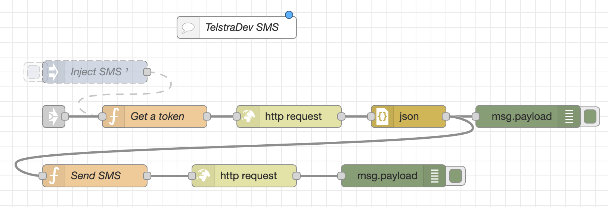
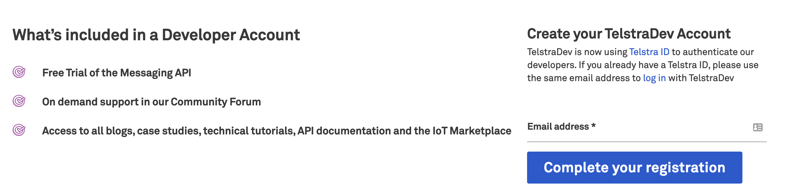
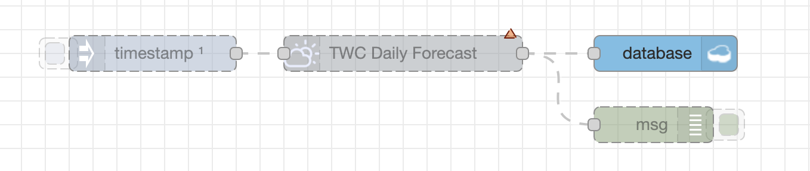

In order to get you familiar with this starter kit and creating services on IBM Cloud, this lab will walk you through the steps of setting up a sample application.

## Table of Contents
* [Create your IBM Cloud Account](https://github.com/Call-for-Code/Solution-Starter-Kit-Hunger-2021/blob/master/lab/README.md#create-your-ibm-cloud-account)
* [Create a Node Red Instance](https://github.com/Call-for-Code/Solution-Starter-Kit-Hunger-2021/blob/master/lab/README.md#create-a-node-red-instance)
* [Integreate a Cloudant Database](https://github.com/Call-for-Code/Solution-Starter-Kit-Hunger-2021/blob/master/lab/README.md#integrate-a-cloudant-database)
* [Creating your Twilio SMS integration](https://github.com/Call-for-Code/Solution-Starter-Kit-Hunger-2021/blob/master/lab/README.md#creating-your-twilio-sms-integration)
* [Creating a Telstra SMS integration](https://github.com/Call-for-Code/Solution-Starter-Kit-Hunger-2021/blob/master/lab/README.md#creating-a-telstra-sms-integration)
* [Integreating with the Weather Company](https://github.com/Call-for-Code/Solution-Starter-Kit-Hunger-2021/blob/master/lab/README.md#integrating-with-the-weather-company)
* [Creating a Dashboard Visualization](https://github.com/Call-for-Code/Solution-Starter-Kit-Hunger-2021/blob/master/lab/README.md#creating-a-dashboard-visualization)
* [Additional Resources](#creating-a-dashboard-visualization)

## Creating your IBM Cloud Account
1. Visit the [IBM Cloud Registration page](https://cloud.ibm.com/registration) and fill out your email and password
2. Check your email for a verification email and click the confirmation link
3. Once your account has been activated, visit your [IBM Cloud Dashboard](https://cloud.ibm.com/). You can always get back to this location by clicking "IBM Cloud" in the upper left of any page.
4. To add a service, click the blue "Create" in the upper left corner of the dashboard.

## Creating a Node Red Instance
1. Visit your [IBM Cloud Dashboard](https://cloud.ibm.com/).
2. In the upper right corner click **Create Resource**.

3. You're now looking at the IBM Cloud Catalog, a list of software and services that you can automatically deploy on the cloud. Find the **Search** box and type `node` to filter down the services. Select **Node-RED App**.

4. For our Node-RED isntance, we will use the Cloudant database. Cloudant is a scalable, distributed cloud database based on Apache CouchDB. This page includes links to the [Cloudant Docs](https://cloud.ibm.com/docs/Cloudant) and [Cloudant API reference](https://cloud.ibm.com/apidocs/cloudant). Click **Get Started** to continue.

5. You're now on the **Create** tab. You'll notice that an application name has been chosen for you, but you can feel free to change it. At the bottom of the page, make sure **Pricing plan** is set to **Lite**. This ensures you will not be charged for the application. Click **Create**.

*Note: You can only have one Cloudant instance using the Lite plan. If you have already got an instance, you will be able to select it from the Pricing plan select box. You can have more than one Node-RED Starter application using the same Cloudant service instance.*
6. After a few moments, your Cloudant database will finish provisioning and will be available for use. At this point, we will be able to create our Node-RED app and store it in the Cloudant database. Click **Deploy your app** to continue.

*TBD: CICD Pipeline*

10. Next, we'll load our example code into the Node-RED environment. Since Node-RED stores its configuration as JSON, we can do that by copying and pasting a JSON file. In the top right of your Node-RED environment, click the **triple-line menu** and select **Import**. 

11. Now, we'll copy the JSON from this starter kit. This JSON is stored in `zero-hunger-node-red-flows.json`. You can access that file [here](https://github.com/Call-for-Code/Solution-Starter-Kit-Hunger-2021/blob/master/lab/zero-hunger-node-red-flows.json). **Copy** this json to your computer clipboard, and **Paste** it into the Node-RED import window. Then click **Import**.

12. Congratulations! Your Node-RED environment is now populated with a number of flows that will help you create your Call for Code application. In the remainder of this lab, we'll cover flows that we have just imported and explain how they can be used together to create more complex applications.

Further reading:
* [How to Create a Node-RED Starter Application on IBM Cloud](https://developer.ibm.com/components/node-red/tutorials/how-to-create-a-node-red-starter-application/)

## Integrate a Cloudant Database

In the last step, we created a Cloudant databae in order to store our Node-RED application. While we are only able to create one Cloudant database on our IBM Cloud Lite tier, we can store information other than our Node-RED application in the same database.

*TBD: Database flow walkthrough*

Further reading:
* [Connecting to IBM Cloud services from Node-RED](https://knolleary.net/2018/06/05/connecting-to-ibm-cloud-services-from-node-red/)
* [Connecting to a Cloudant Database in Node-RED](https://medium.com/@ml4den/connecting-to-a-cloudant-database-in-node-red-37239bfc9ede)

## Creating your Twilio SMS integration

Since local farmers often do not possess smartphones, we anticipate that SMS will become a critical component of communications in many Call for Code solutions. To facilitate this, we've created a sample Twilio SMS flow, along with additional resources below.

1. In order to get started, you'll need a Twilio account. [Sign up for Twilio here](www.twilio.com/referral/lup4VV).

*TBD: Twilio flow walkthrough*

## Creating a Telstra SMS integration

When addressing the Australian market, an integration with Telstra can facilitate communication with local stakeholders. This section will cover our example Telstra Node-RED flow.

*TBD: Telstra flow walkthrough*

1. [Register for your TelstraDev account here](https://dev.telstra.com/tdev/user/register). This will require you to create a Telstra ID, if you don't already have one.

2. Check your email and click on the link in the Telstra verification email.
3. Enter your phone number (including country code) and request a one-time verification token. When you receive the code, enter it to proceed to the Telstra Developer Dashboard.

### Further reading:
* [Telstra Messaging API documentation](https://dev.telstra.com/content/messaging-api)
* [Example Flow: A Node-RED flow to send SMS messages via the Telstra Messaging API](https://github.com/brendan-myers/node-red-contrib-telstra-messaging)

## Integrating with the Weather Company

*TBD: Waiting on keys*

The Weather Company is an IBM business that provides a number o 

## Creating a Dashboard Visualization

*TBD: Dashboard explanation*

## Additional Resources
* [API Documentation Links](https://github.com/Call-for-Code/Solution-Starter-Kit-Hunger-2021/blob/master/README.md#api-integration-documentation)
